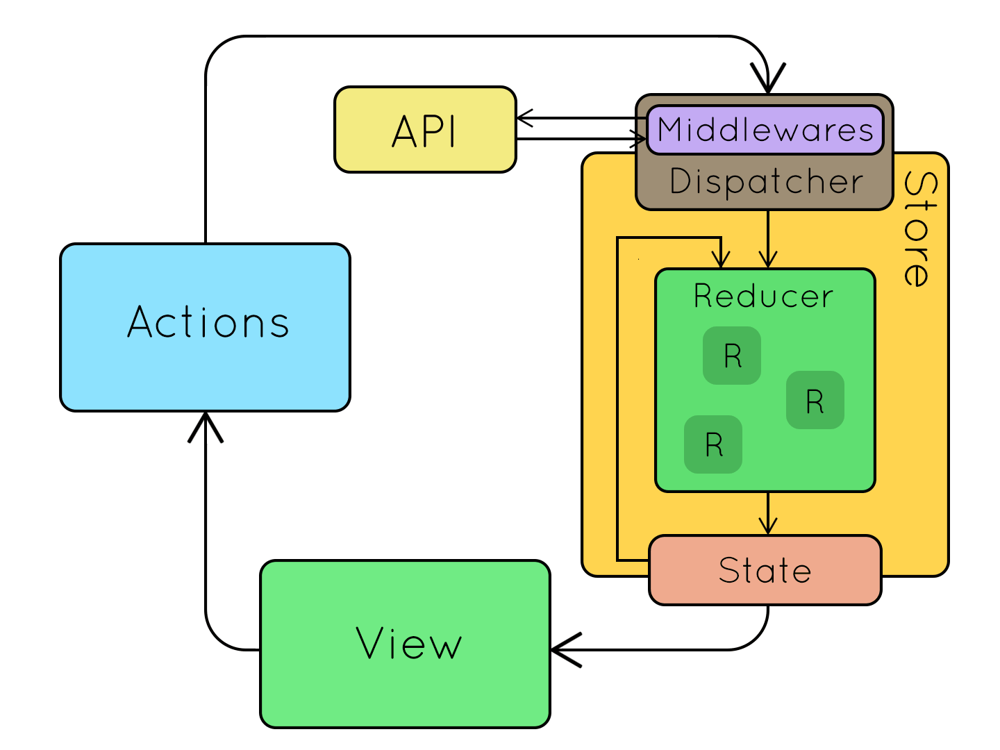
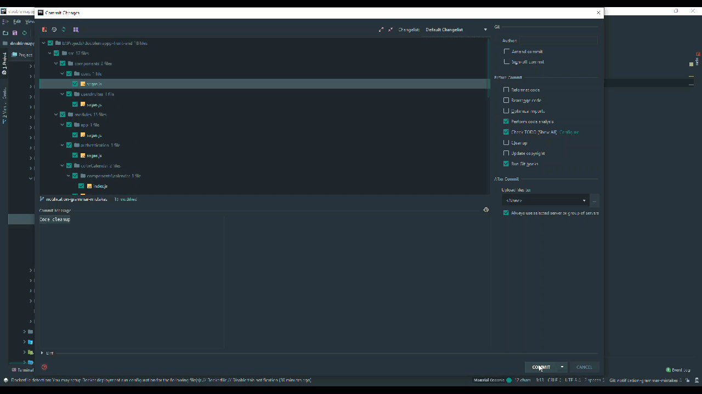
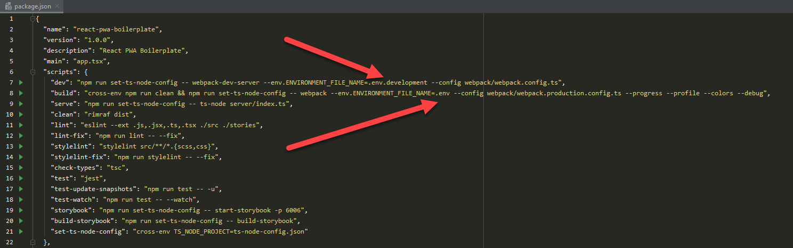
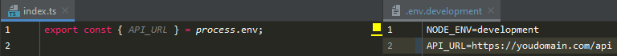

# React Boilerplate
Boilerplate for quick start of modular ReactJS application using TypeScript, Redux, Redux-Saga and SCSS
with predefined Code Quality tools and other helpful things.

## Basic Setup
These steps are required before further steps.

### Machine Requirements
You need to have installed:  
- [Node.js](https://nodejs.org/en/)
- [NPM Package manager](https://www.npmjs.com/)
- Cloned or downloaded version of this Project

To prepare Application for further steps after repository clone you need to run next commands:
```sh
cd <PROJECT_DIR>
npm install
```
These commands are going to help you to install all Project dependencies.

## Development Start
To run Application in development mode you need to run `npm run dev`.
As a result, you will get a fully completed local development environment and run a development server at the [http://localhost:3000](http://localhost:3000). 
```sh
npm run dev
```

## Build Production
To build an optimized production version you need to run `npm run build`, after completion, you will have bundled production
code that you can use to deploy it to your hosting. You can take the result at the `~/dist/` folder
```sh
npm run build
```

## Useful Commands 
`npm run build:debug` -
Runs build of the optimized production version with enabled debug mode of the loaders using [webpack --debug](https://webpack.js.org/api/cli/#debug-options).
 
`npm run serve` -
Runs local HTTP server targeting `~/dist/` directory as public at the [http://localhost:4000](http://localhost:4000).

`npm run clean` -
Removes Production Build folder `~/dist/`.

`npm run lint` -
Checks Project for ESLint errors and warnings.

`npm run lint:fix` -
Automatically resolve as much as possible ESLint errors. If not all resolved will throw an error.

`npm run stylelint` -
Checks Project for SCSS or CSS stylelint errors and warnings.

`npm run stylelint:fix` -
Automatically resolve as much as possible stylelint errors and warnings. If not all resolved will throw an error.

`npm run check-types` -
Checks the Project for TypeScript typings issues.

`npm run test` -
Runs all automatic tests and shows how many tests passed and broken.

`npm run test:update-snapshot` -
Updates tests snapshots and shows how many tests passed and broken.

`npm run test:watch` -
Watches files for changes and runs tests related to changed files.

`npm run storybook` -
Runs Storybook which is an open-source tool for developing UI components in isolation. It makes building stunning UIs organized and efficient.

`npm run storybook:build` -
Builds static Storybook to the `~/storybook-static/`

## Architecture

### Basic Info
* [TypeScript](http://www.typescriptlang.org) - It's a typed superset of JavaScript that compiles to plain JavaScript.
* [React](https://reactjs.org) - A JavaScript library for building user interfaces.
* [Redux](https://redux.js.org) - State management of the Application.
* [Redux-Saga](https://redux-saga.js.org) - Redux middleware library, that is designed to make handling side effects in your Redux Application nice and simple.
* [Redux-Form](https://redux-form.com) - Helps to flexible and predictable manage forms state in Redux.
* [Axios](https://github.com/axios/axios) - Promise based HTTP client for the browser. Helps to organize all HTTP request of the Application.
* [SASS (SCSS syntax)](https://sass-lang.com) - CSS pre-processor that helps to organize styles of the Application.

### Data Flow
Redux architecture revolves around a strict unidirectional data flow.

This means that all data in an application follows the same lifecycle pattern, making the logic of your app more predictable and easier to understand.
You can read more [here](https://redux.js.org/basics/data-flow).


## Code Quality Guards

#### [TypeScript](http://www.typescriptlang.org)
Types help to build a more scalable, readable and stable application with an increase of developer productivity and potential time-saving.

#### [ESLint](https://eslint.org)
The pluggable linting utility for JavaScript/TypeScript and JSX/TSX files.
It helps to write code in such a way that it is in a single code-style as if written by one developer, which saves a lot of time
on maintainability and introducing new developers into the team. ESLint also avoids some commonplace errors, such as a forgotten semicolon,
an attempt to reassign a value to a constant, etc., which also saves time during the Code Review and debug.

#### [Stylelint](https://stylelint.io)
The pluggable linting utility for style files of the Project. It's almost the same as ESLint, but for styles :)

#### [Automatic Tests](#testing)
You can see more details below in [related section](#testing).

#### [Git Hooks](https://git-scm.com/docs/githooks)
You cannot commit and push changes before the TypeScript, ESLint and Stylelint checks are passed and the errors are fixed.
By default, hooks will try to fix as much as possible errors automatically. If there are not all errors fixed in an automatic way - you need to fix them manually.


## Environments Settings

Project uses environment variables to be well customizable across different environments.

#### Environment variables are useful when:
* Values are different across multiple environments(such as Development, QA, Staging, Production).
* Values change frequently and are highly dynamic.
* Environment variables can be changed easily - especially when running in CI/CD.

All environments files should be placed in the `~/environments/` directory. Then you can just specify a environment file name during build time via environment variable `ENVIRONMENT_FILE_NAME`.

#### Usage example:



## Testing

Automated tests give you confidence that your module or unit is working as intended. Such tests can be run as much as you like.
Successful execution of the tests will show the developer that his changes did not break anything, that it was not planned to break.

A failed test will reveal that changes have been made to the code that changes or break their behavior.
Examining the error that the failed test gives and comparing the expected result with the obtained one will make it possible
to understand where the error occurred, whether it is in the code or in the requirements.

#### Project have next predefined instruments for testing:
- [Jest](https://jestjs.io/) - Jest is a delightful JavaScript Testing Framework with a focus on simplicity.
- [Enzyme](https://airbnb.io/enzyme/) - Enzyme is a JavaScript Testing utility for React that makes it easier to test your React Components' output. You can also manipulate, traverse, and in some ways simulate runtime given the output.

#### Useful commands
`npm run test` -
Runs all automatic tests and shows how many tests passed or broken.

`npm run test:update-snapshot` -
Updates test snapshots and then show how many tests passed or broken.

`npm run test:watch` -
Watches files for changes and runs tests related to changed files and other interactive features such as a search for specific tests via pattern.


## License
Project is licensed under the [MIT](https://opensource.org/licenses/MIT) license.
