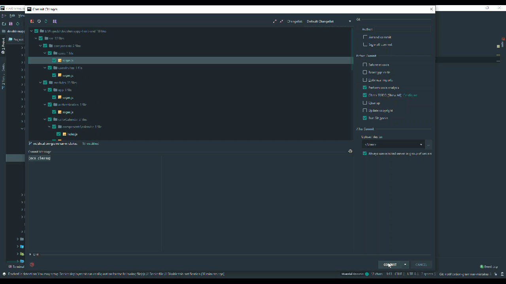
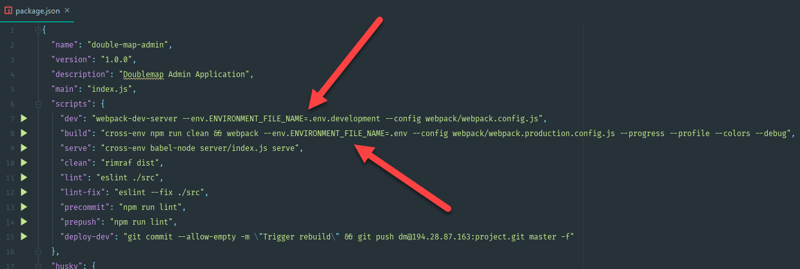
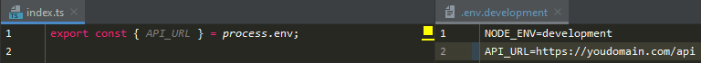

# React PWA Boilerplate
Admin part of the Double Map tickets system Mobile Application

## Basic Setup
These steps are required before further steps.

### Machine Requirements
You need to have installed:  
- [Node.js](https://nodejs.org/en/)  
- [NPM Package manager](https://www.npmjs.com/)  
- Cloned or downloaded version of this project

To prepare Application for further steps after repository clone you need run next commands:
```sh
cd <PROJECT_DIR>
npm install
```

## Development Start
To run Application in development mode you need to run `npm run dev`. As result, you will get fully completed local development environment.
```sh
npm run dev
```

## Build Production
To build optimized production version you need to run `npm run build`, after completion, you will have bundled production code that you can use to deploy it to your hosting. You can take the result at the `~/dist` folder
```sh
npm run build
```

## Useful Commands
`npm run lint` -
Check Project for ESLint errors and warnings. Very useful in pair with some CI/CD or Git Hooks.

`npm run lint-fix` -
Automatically resolve as much as possible ESLint errors with

`npm run clean` -
Removes Production Build folder

`npm run serve` -
Starts local HTTP server to serve Production Build code at the localhost

`npm run deploy-dev` -
You can use here any command or commands sequence to deploy project to the VPS or hosting.

## Git Flow

#### Git Hooks

You cannot commit and push changes before the ESLint is passed and the errors are corrected.


## Environments Settings

Boilerplate uses environment variables to be well customizable across different environments.

#### Environment variables are useful when:
* Values are different across multiple environments(such as Development, QA, Staging, Production).
* Values change frequently and are highly dynamic.
* Environment variables can be changed easily - especially when running in CI/CD.

All environments files should be placed in the `~/environments/` directory. Then you can just specify a environment file name during build time via environment variable `ENVIRONMENT_FILE_NAME`.

#### Usage example:



## Testing

Automated tests give you confidence that your module or unit is working as intended. Such tests can be run as much as you like.
Successful execution of the tests will show the developer that his changes did not break anything, that it was not planned to break.

A failed test will reveal that changes have been made to the code that changes or break their behavior.
Examining the error that the failed test gives and comparing the expected result with the obtained one will make it possible
to understand where the error occurred, whether it is in the code or in the requirements.

#### Boilerplate have next predefined instruments for testing:
- [Jest](https://jestjs.io/) - Jest is a delightful JavaScript Testing Framework with a focus on simplicity.
- [Enzyme](https://airbnb.io/enzyme/) - Enzyme is a JavaScript Testing utility for React that makes it easier to test your React Components' output. You can also manipulate, traverse, and in some ways simulate runtime given the output.

#### Useful commands
`npm run test` -
Runs all automatic tests and shows how many tests passed or broken.

`npm run test-update-snapshot` -
Updates test snapshots and then show how many tests passed or broken.

`npm run test-watch` -
Watches files for changes and runs tests related to changed files and other interactive features such as a search for specific tests via pattern.


## License
React PWA Boilerplate is [licensed as MIT](https://github.com/facebook/create-react-app/blob/master/LICENSE).
